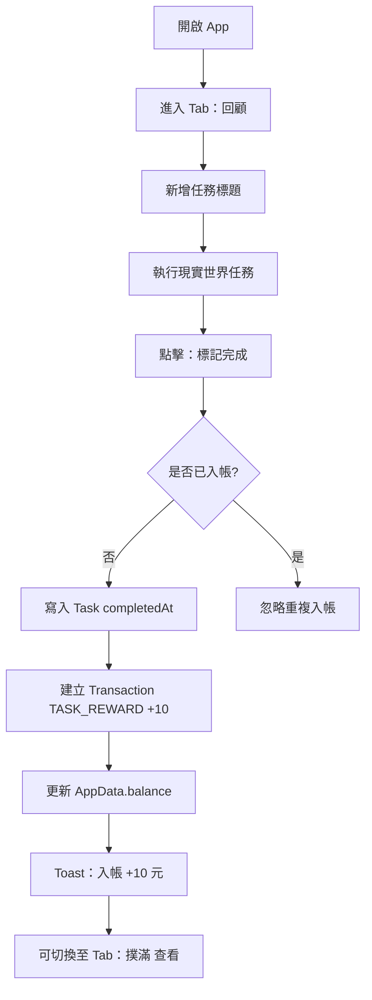
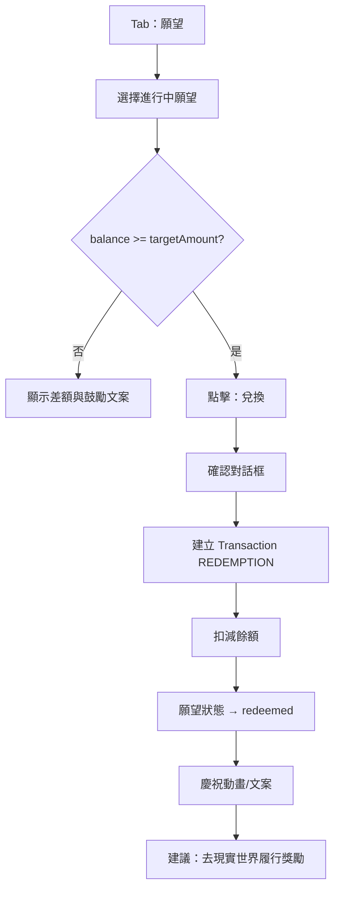
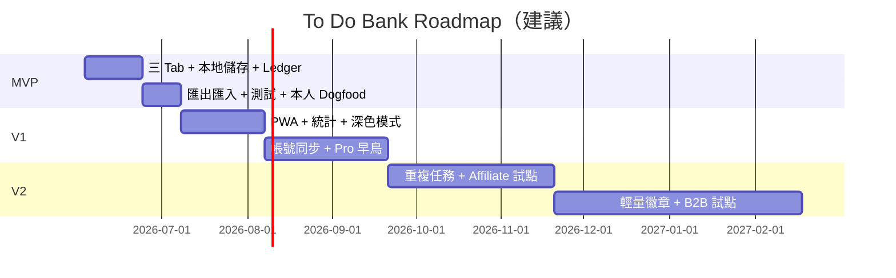

# To Do Bank（自我獎勵系統）產品需求文件（PRD）

| 欄位 | 內容 |
|------|------|
| **文件版本** | v1.0 |
| **最後更新** | 2026-06-03 |
| **產品代號** | To Do Bank |
| **文件狀態** | Draft — 可作為產品與創業決策參考 |
| **作者** | 產品負責人（Side Project） |
| **技術棧（MVP）** | Vite + React、LocalStorage / IndexedDB |

---

## 目錄

1. [Executive Summary](#1-executive-summary)
2. [問題與機會](#2-問題與機會)
3. [目標客群（Target Personas）](#3-目標客群target-personas)
4. [市場分析](#4-市場分析)
5. [競品分析](#5-競品分析)
6. [產品定位與差異化](#6-產品定位與差異化)
7. [功能需求（Functional Requirements）](#7-功能需求functional-requirements)
8. [非功能需求](#8-非功能需求)
9. [資訊架構與 UX](#9-資訊架構與-ux)
10. [資料模型概要](#10-資料模型概要)
11. [商業模式（Business Model）](#11-商業模式business-model)
12. [Go-to-Market](#12-go-to-market)
13. [成功指標（KPIs）](#13-成功指標kpis)
14. [風險與假設](#14-風險與假設)
15. [Roadmap](#15-roadmap)
16. [附錄](#16-附錄)

---

## 1. Executive Summary

### 1.1 產品願景

讓「完成待辦」不再只是打勾，而是可累積、可兌換、可期待的自我獎勵循環——使用者透過**待辦回顧**賺取虛擬代幣，在**撲滿**中看見努力累積，並以**願望清單**把抽象自律轉成具體目標（例如：存滿 500 元虛擬幣就「兌換」一次週末電影）。

### 1.2 價值主張

| 對象 | 價值 |
|------|------|
| **使用者** | 低摩擦記錄完成事項 → 即時正向回饋（+10 元/筆）→ 餘額驅動的目標感，不需真實金流即可建立「努力有價」的心理帳戶 |
| **相對待辦 App** | 不只管理任務，還連結**動機閉環**（完成 → 入帳 → 兌換） |
| **相對純遊戲化 App** | 不強制 RPG/社交，聚焦**個人撲滿 + 願望**，適合不想被社群壓力綁架的人 |

### 1.3 一句話定位

> **To Do Bank：把待辦完成變成可存進撲滿的虛擬獎勵，再用願望清單兌換你為自己設定的獎勵。**

### 1.4 當前階段定位（雙軌）

| 路徑 | 定義 | 成功標準 |
|------|------|----------|
| **路徑 A：個人 Side Project** | 自用 MVP，驗證動機設計與技術可行性 | 本人連續 30 天使用、週任務完成率提升 |
| **路徑 B：產品化** | 面向繁中/亞洲個人生產力 + 自我獎勵細分市場 | 1,000 MAU、D7 留存 ≥ 25%、付費轉換試驗 |

本 PRD 同時服務兩條路徑：MVP 以路徑 A 為主，商業與 GTM 章節以路徑 B 為「若要做成產品」的務實規劃。

---

## 2. 問題與機會

### 2.1 核心痛點

1. **待辦 App 完成感薄弱**：勾選後缺乏「值得慶祝」的儀式，長期易淪為清單機器。
2. **外在獎勵難以自我設計**：真實記帳 App 管的是支出/收入，不是「我完成 5 件事就值得一杯手搖」這類**行為—獎勵**連結。
3. **遊戲化過重或過輕**：Habitica 等 RPG 門檻高；純習慣追蹤又缺少「存下來再花」的延遲滿足感。
4. **延遲滿足難堅持**：知道要存錢、要運動，但日常小勝利沒有被**可視化累積**。

### 2.2 為什麼現在

| 趨勢 | 與 To Do Bank 的關聯 |
|------|----------------------|
| **個人數位健康/Wellness App 滲透提高** | 使用者已習慣用手機管理身心與習慣（台灣網路使用者約 2,210 萬，滲透率 ~95%） |
| **生產力 App 市場持續成長** | 全球 Productivity Apps 約 USD 131.5 億（2025），CAGR ~10% |
| **Gamification 成熟但同質化** | 點數/徽章氾濫；**撲滿式 Ledger + 自訂願望**仍是差異化切口 |
| **在地化與隱私意識** | 個人動機工具可先以**本地儲存、無帳號**切入，降低信任成本 |
| **Side Project / Indie 工具文化** | Product Hunt、X/Threads 分享「自建動機系統」具傳播性 |

### 2.3 競品缺口（摘要）

- **待辦巨頭**（Todoist、Things）：強在協作與排程，弱在**個人虛擬經濟與願望兌換**。
- **習慣/RPG**（Habitica）：強在社群與遊戲，弱在**簡潔撲滿隱喻**與低學習成本。
- **療癒陪伴**（Finch）：強在情緒支持，弱在**任務—金流—願望**一條龍。
- **記帳 App**：管真實金錢，不適合「完成報告 +10 元」的**行為貨幣**。

詳見 [§5 競品分析](#5-競品分析)。

---

## 3. 目標客群（Target Personas）

### Persona 1：小晴 — 自律修復中的上班族

| 維度 | 描述 |
|------|------|
| **Demographics** | 28 歲，台北，行銷/營運，單身或同居 |
| **行為** | 用 Apple 提醒事項或 Notion 列待辦，常拖延；月底對「又一事無成」焦慮 |
| **動機** | 需要**即時、可累積**的正向回饋，而非空泛「要更努力」 |
| **使用場景** | 下班前勾完 3 件工作小事 → 打開 To Do Bank 回顧 → 看撲滿 +30 → 離線也能用 |
| **痛點** | Habitica 太像遊戲；Todoist 勾完沒爽感 |
| **願望範例** | 「存 300 → 週五手搖免罪券」「存 800 → 買一本想讀很久的書」 |

### Persona 2：阿哲 — 備考/進修的自學者

| 維度 | 描述 |
|------|------|
| **Demographics** | 22 歲，大學/研究所，备考證照或語言 |
| **行為** | 番茄鐘 + 待辦混用，重視**連續天數**與可視化進度 |
| **動機** | 把學習任務切成可兌換單位，對抗倦怠 |
| **使用場景** | 每完成一個章節題目集 → 記一筆任務完成 → 週末用累積餘額「兌換」半日休息 |
| **痛點** | 純打卡 App 沒有「存錢」隱喻；真實記帳與讀書無關 |
| **願望範例** | 「存 500 → 打 2 小時遊戲無罪感」 |

### Persona 3：美玲 — 想建立家庭任務習慣的兼職媽媽

| 維度 | 描述 |
|------|------|
| **Demographics** | 35 歲，兼職 + 育兒，時間碎片化 |
| **行為** | 家務、育兒、副業並行，很少為自己設定獎勵 |
| **動機** | **替自己**留一個心理帳戶：「我今天的付出有記錄」 |
| **使用場景** | 孩子午睡的 20 分鐘完成 2 件小事 → 快速回顧入帳 → 看願望進度條 |
| **痛點** | 複雜 App 學不起來；需要大字、少步驟、離線可用 |
| **願望範例** | 「存 1,000 → 一杯咖啡 + 30 分鐘獨處」 |

### 客群優先序（MVP → 產品化）

1. **P0**：Persona 1、2（數位原生、願分享、痛點明確）
2. **P1**：Persona 3（需 V1  UX 簡化與可及性）
3. **P2（B2B 潛力）**：企業 wellness 專案經理 — 見 [§11](#11-商業模式business-model)

---

## 4. 市場分析

> **聲明**：以下 TAM/SAM/SOM 為**自下而上（bottom-up）與公開報告交叉校準的估算**，不同研究機構對「生產力 / 習慣 / Wellness」邊界定義不一，數字僅供策略參考，非投資級精算。

### 4.1 參考市場規模（外部數據）

| 市場區隔 | 2025 約略規模 | CAGR | 資料來源（估算基礎） |
|----------|---------------|------|----------------------|
| **全球 Productivity Apps** | USD 131.5 億 | ~9.9%（至 2034） | Fortune Business Insights, *Productivity Apps Market* |
| **全球 Productivity Software（廣義）** | USD 684 億 | ~9.0% | DataIntelo, *Productivity Software Market* |
| **全球 Habit Tracker Apps（狹義）** | USD 16 億 | ~6.5% | Market Research Future, *Habit Tracker App Market* |
| **全球 Habit Tracking（廣義報告）** | USD 130 億級 | ~14% | 多份 habit/wellness 報告（定義含 AI、心理健康等，**偏高**） |
| **台灣人口 / 網路** | 2,320 萬人 / 2,210 萬網路使用者 | — | DataReportal, *Digital 2025: Taiwan* |
| **台灣智慧型手機使用者** | ~2,010 萬（2024）→ 2,081 萬（2029 預測） | +3.5% | Statista, *Smartphone users Taiwan* |

**採用原則**：TAM 以「個人數位自我改善 + 生產力 App」交集估算；SAM 鎖定「願為習慣/動機工具付費或深度使用」族群；SOM 為新創 3–5 年可觸及份額。

### 4.2 TAM（Total Addressable Market）

**定義**：全球願意使用「數位工具管理個人任務、習慣或自我獎勵」的網路使用者所對應的軟體支出/價值池。

**推算邏輯（bottom-up）**：

```
全球網路使用者 ≈ 54 億（ITU / DataReportal 2025 量級）
× 曾使用過生產力或健康類 App 的比例 ≈ 35%（行業報告常引用 30–40%）
≈ 18.9 億潛在使用者

× 年均每使用者可歸因價值（ARPU 代理）≈ USD 8
  （含免費+付費混合：假設 5% 付費 × USD 60/年 + 95% × USD 0–廣告/資料價值）
≈ USD 151 億 / 年
```

**TAM 區間**：**USD 120 億 – 180 億 / 年**（與 Productivity Apps ~131 億 + Habit 狹義市場交叉驗證）。

### 4.3 SAM（Serviceable Addressable Market）

**定義**：To Do Bank **可直接服務**的族群——個人、重視**繁中/英文 UI**、接受「虛擬撲滿 + 願望」模式、使用 Web/行動瀏覽器或 PWA。

**台灣 SAM（bottom-up）**：

```
台灣網路使用者 2,210 萬
× 18–45 歲且關注自我成長比例 ≈ 45% ≈ 995 萬
× 每月至少使用 1 款生產力/習慣 App ≈ 40% ≈ 398 萬
× 對「遊戲化但非重度 RPG」有興趣 ≈ 25% ≈ 99.5 萬 核心觸達人群

× 可接受付費或願看廣告的年度價值 ≈ NT$ 360（≈ USD 11）
台灣 SAM 收入潛力 ≈ 99.5 萬 × NT$ 360 ≈ NT$ 3.58 億 / 年（≈ USD 1,100 萬）
```

**全球 SAM（中文 + 英文個人動機工具）**：

```
全球 Productivity Apps 活躍付費/深度用戶池（假設 2 億人）
× 細分「自我獎勵 / 習慣經濟」適配率 8% = 1,600 萬人
× ARPU USD 12
≈ USD 1.92 億 / 年
```

**SAM 合計（台灣 + 全球華語/英語個人）**：約 **USD 2.0 億 – 2.5 億 / 年**。

### 4.4 SOM（Serviceable Obtainable Market）

**定義**：新創 3 年內，無大型行銷預算下**可實際取得**的用戶與收入。

| 情境 | 假設 | 3 年 SOM |
|------|------|----------|
| **保守（Side Project 維持）** | 累積 5,000 MAU，付費率 2%，ARPU USD 30/年 | **USD 3,000 / 年** |
| **基準（產品化 Indie）** | 30,000 MAU，付費率 4%，ARPU USD 40/年 | **USD 48,000 / 年** |
| **樂觀（PMF + 口碑）** | 150,000 MAU，付費率 5%，ARPU USD 45/年 | **USD 337,500 / 年** |

**台灣份額（基準）**：若 MAU 30% 來自台灣 → 9,000 MAU → 約 **NT$ 130 萬 / 年**收入潛力（以 Pro NT$ 390/年計）。

### 4.5 市場洞察（策略含義）

1. **市場夠大、但極分散**——不宜一開始就與 Todoist 正面對打排程。
2. **細分切口**：「行為 → 虛擬 Ledger → 願望兌換」在習慣經濟中仍少見。
3. **台灣適合冷啟動**：高網路滲透、社群傳播快，但付費習慣需用**低價 Pro + 強免費核心**教育。

---

## 5. 競品分析

### 5.1 競品比較矩陣（Comparison Matrix）

| 維度 | **To Do Bank** | **Todoist** | **Habitica** | **Finch** | **記帳 App**（如 Moze/随手记） | **Streaks / 習慣類** |
|------|----------------|-------------|--------------|-----------|--------------------------------|----------------------|
| **核心隱喻** | 撲滿 + 願望兌換 | 任務/Inbox | RPG 冒險 | 虛擬寵物療癒 | 真實收支 | 連續天數 |
| **任務管理** | 中（回顧導向） | 強 | 中 | 弱 | 無 | 弱（習慣項） |
| **虛擬貨幣** | **核心** | 無/Karma 弱 | 金幣/裝備 | 寶石 | 無（真錢） | 無或極弱 |
| **願望/目標商城** | **自訂願望** | 無 | 裝備/任務獎勵 | 裝飾 | 預算目標 | 無 |
| **Ledger 透明度** | **完整流水** | 無 | 有但遊戲化複雜 | 部分 | 有 | 無 |
| **社交/公會** | 無（MVP） | 協作 | 強 | 弱 | 無 | 可選 |
| **學習成本** | 低 | 中 | 高 | 低 | 中 | 低 |
| **離線/隱私** | **本地優先** | 雲端 | 雲端 | 雲端 | 混合 | 多為本地 |
| **定價** | 免費（規劃 Pro） | 訂閱 | 訂閱 | 訂閱 | 免費+Pro | 買斷/訂閱 |
| **適合人群** | 要「存下來再兌換」者 | 重度排程 | 遊戲化玩家 | 情緒支持 | 理財 | 極簡習慣 |

### 5.2 競品深度摘要

**Todoist**  
- 優勢：自然語言、專案、整合日曆。  
- 缺口：完成任務的獎勵感需靠外部習慣，內建 Karma 幾乎無撲滿/願望敘事。

**Habitica**  
- 優勢：習慣—遊戲迴路成熟、社群動力。  
- 缺口：RPG 設定門檻高；**真實生活願望**（如「看電影」）不如裝備直覺。

**Finch**  
- 優勢：低壓力、心理健康向、留存設計佳。  
- 缺口：不以「待辦—入帳—兌換」為主軸。

**記帳 App**  
- 優勢：金流真實、報表完整。  
- 缺口：不獎勵「完成任務」；心理帳戶與行為帳戶混淆成本高。

### 5.3 競爭策略結論

- **不做的**：企業級協作、複雜排程、開放世界 RPG。  
- **要做的**：3 Tab 內完成「回顧 → 看餘額 → 兌換願望」< 60 秒路徑。  
- **護城河（長期）**：Ledger 資料資產、個人願望庫、行為—獎勵配對的**可攜歷史**（V1 雲端同步後）。

---

## 6. 產品定位與差異化

### 6.1 定位陳述

**For** 想建立可持續自律但厭倦重度遊戲化或純勾選的人，  
**To Do Bank** 是一個個人自我獎勵系統，  
**That** 將待辦完成轉為虛擬入帳、以撲滿累積餘額、並對自訂願望解鎖兌換，  
**Unlike** 傳統待辦或記帳 App，  
**Our product** 專注「行為貨幣」與可審計的 Ledger，讓動機可見、可存、可花。

### 6.2 差異化支柱（UVP）

| # | 支柱 | 說明 |
|---|------|------|
| 1 | **撲滿隱喻一致** | 餘額 = 累計入帳 − 已兌換；每筆任務 +10 元規則簡單可記 |
| 2 | **願望由使用者定義** | 非平台商城，而是「對自己承諾」的目標金額 |
| 3 | **Ledger 可審計** | 每筆 TASK_REWARD / REDEMPTION 可追溯，建立信任感 |
| 4 | **本地優先 MVP** | 無帳號即可用，降低隱私顧慮與冷啟動摩擦 |
| 5 | **動機優先於排程** | 回顧「完成了什麼」優先於「計劃什麼」（V1 再補排程） |

---

## 7. 功能需求（Functional Requirements）

### 7.1 功能分級總覽

| 階段 | 時間框（建議） | 目標 |
|------|----------------|------|
| **MVP** | 0–6 週 | 個人可用、本地持久化、三 Tab 閉環 |
| **V1** | 2–4 月 | 雲端備份、統計、UX 打磨、可選 Pro |
| **V2** | 6–12 月 | 多裝置、進階 gamification、B2B 試點 |

### 7.2 MVP 功能需求

#### FR-MVP-01 待辦回顧（Task Review）

| 項目 | 內容 |
|------|------|
| **User Story** | 作為使用者，我想記錄今天完成的一件事，並立即看到撲滿入帳，以獲得成就感。 |
| **描述** | 新增/完成任務記錄；完成時自動產生 +10 元 `TASK_REWARD` 交易。 |
| **Acceptance Criteria** | AC1：可新增任務標題（必填，≤ 200 字）。 AC2：標記完成後狀態為 `completed`，且 `completedAt` 有時間戳。 AC3：每筆完成僅觸發一次入帳。 AC4：完成後餘額即時更新。 AC5：可刪除未完成任務；已完成任務刪除需連動撤銷或禁止（MVP 建議：**禁止刪除已完成**，僅允許「撤銷完成」在 5 分鐘內）。 |

#### FR-MVP-02 撲滿與 Ledger（Piggy Bank）

| 項目 | 內容 |
|------|------|
| **User Story** | 作為使用者，我想查看餘額與每筆收支，以確認努力有被記錄。 |
| **描述** | 顯示當前餘額；交易列表依時間倒序；類型含 `TASK_REWARD`、`REDEMPTION`。 |
| **Acceptance Criteria** | AC1：餘額 = Σ(credit) − Σ(debit)，與交易一致。 AC2：每筆交易含 `id`, `type`, `amount`, `createdAt`, 關聯 `taskId` 或 `wishId`（若有）。 AC3：空狀態有引導文案。 AC4：金額為整數，預設幣別為「元」（虛擬）。 |

#### FR-MVP-03 願望清單（Wish List）

| 項目 | 內容 |
|------|------|
| **User Story** | 作為使用者，我想設定一個需要花費虛擬幣的願望，並在存夠時兌換它。 |
| **描述** | CRUD 願望；欄位含名稱、目標金額 `targetAmount`；當 `balance >= targetAmount` 可兌換。 |
| **Acceptance Criteria** | AC1：建立願望時 `targetAmount` > 0。 AC2：兌換時產生 `REDEMPTION` 交易，金額 = `targetAmount`。 AC3：餘額不足時兌換按鈕 disabled 並提示差額。 AC4：兌換後願望狀態為 `redeemed`（或歸檔），不可重複兌換同一筆。 AC5：可有多個進行中願望；已兌換願望可選擇隱藏或移至「已兌換」區。 |

#### FR-MVP-04 本地持久化（Persistence）

| 項目 | 內容 |
|------|------|
| **User Story** | 作為使用者，我想關閉瀏覽器後資料仍在。 |
| **描述** | 使用 LocalStorage 或 IndexedDB 儲存 `AppData`；啟動時載入。 |
| **Acceptance Criteria** | AC1：重新整理頁面後資料不丟失。 AC2：儲存失敗時顯示錯誤且不靜默覆蓋。 AC3：提供「匯出 JSON」與「匯入 JSON」（MVP 建議列入，降低資料鎖死風險）。 |

#### FR-MVP-05 三 Tab 導航

| 項目 | 內容 |
|------|------|
| **User Story** | 作為使用者，我想在回顧、撲滿、願望之間快速切換。 |
| **Acceptance Criteria** | AC1：底部（或頂部）Tab：回顧 / 撲滿 / 願望。 AC2：當前 Tab 有視覺標示。 AC3：切換不重置未儲存狀態（若有表單則提示）。 |

#### FR-MVP-06 預設獎勵規則

| 項目 | 內容 |
|------|------|
| **描述** | 每完成一筆任務固定 +10 元（常數可配置於 `AppData.settings`）。 |
| **Acceptance Criteria** | AC1：預設值 10。 AC2：修改設定僅影響**新完成**任務（不追溯）。 |

### 7.3 V1 功能需求（節選）

| ID | 功能 | User Story 摘要 | Acceptance Criteria 要點 |
|----|------|-----------------|-------------------------|
| FR-V1-01 | 雲端同步 | 換裝置仍能恢復 | 帳號登入、衝突策略（last-write-wins 或合併提示） |
| FR-V1-02 | 統計儀表板 | 看本週完成數與入帳 | 週/月圖表、完成率 |
| FR-V1-03 | 自訂單筆獎勵 | 大任務想給 50 元 | 完成時可選獎勵倍率（Pro） |
| FR-V1-04 | 願望封面/圖示 | 視覺化目標 | 上傳或 emoji |
| FR-V1-05 | 深色模式 | 夜間使用 | 跟隨系統 |
| FR-V1-06 | PWA / 安裝到手機 | 像 App 一樣開啟 | manifest + offline shell |
| FR-V1-07 | 備份提醒 | 怕資料遺失 | 每 30 天提示匯出 |

### 7.4 V2 功能需求（節選）

| ID | 功能 | 說明 |
|----|------|------|
| FR-V2-01 | 任務模板/重複 | 每日晨間例行 |
| FR-V2-02 | 願望靈感庫 | 平台建議願望，非強制商城 |
| FR-V2-03 | Affiliate 連結 | 願望綁定電商連結（變現） |
| FR-V2-04 | 家庭/團隊空間 | B2B2C 小型群組 |
| FR-V2-05 | API / Webhook | 與 Notion、Shortcuts 整合 |
| FR-V2-06 | 成就徽章（輕量） | 100 筆完成等里程碑，不干擾主流程 |

### 7.5 優化 backlog（Sprint A，2026-06）

| ID | 功能 | 狀態 |
|----|------|------|
| FR-OPT-01 | **釘選願望**：`settings.pinnedWishId` 持久化；願望卡可設主目標；Dashboard 優先顯示釘選；刪除／兌換自動清除 | 已完成 |
| FR-OPT-02 | **入帳敘事**：完成入帳 Toast 下方顯示距離釘選願望的差額與進度％ | 已完成 |
| FR-OPT-03 | **分類前綴**：快速分類標籤帶入 `[工作]` 等可編輯前綴；提交 strip，category 結構化儲存 | 已完成 |

---

## 8. 非功能需求

### 8.1 效能（Performance）

| ID | 需求 | 指標 |
|----|------|------|
| NFR-P1 | 首屏可互動 | LCP < 2.5s（本地 MVP，無後端） |
| NFR-P2 | 交易列表渲染 | 1,000 筆內滾動流暢（虛擬列表 V1） |
| NFR-P3 | 寫入延遲 | 完成任務 → 餘額更新 < 100ms（本地） |

### 8.2 離線（Offline）

| ID | 需求 |
|----|------|
| NFR-O1 | MVP 全功能離線可用（無網路依賴） |
| NFR-O2 | V1 PWA 支援離線開啟已快取 shell |
| NFR-O3 | 匯出/匯入不依賴伺服器 |

### 8.3 隱私與安全（Privacy & Security）

| ID | 需求 |
|----|------|
| NFR-PR1 | MVP 資料僅存於本機，不上傳 |
| NFR-PR2 | 不收集 PII（無帳號則無註冊資料） |
| NFR-PR3 | V1 雲端同步需加密傳輸（TLS）與隱私政策 |
| NFR-PR4 | 匯入 JSON 需驗證 schema，防 XSS/注入 |

### 8.4 可及性（Accessibility）

| ID | 需求 |
|----|------|
| NFR-A1 | 對比度符合 WCAG AA（V1） |
| NFR-A2 | Tab 與按鈕可鍵盤操作 |
| NFR-A3 | 表單欄位有 `label` / `aria-label` |
| NFR-A4 | 金額變化以文字 + 圖示雙重提示（非僅顏色） |

### 8.5 可靠性與維護

| ID | 需求 |
|----|------|
| NFR-R1 | 儲存版本號 `schemaVersion`，支援 migration |
| NFR-R2 | 寫入採原子更新（單一 `AppData` 物件一次 commit） |
| NFR-R3 | 錯誤邊界：React Error Boundary 避免白屏 |

### 8.6 相容性

- 瀏覽器：Chrome / Safari / Firefox 近兩個 major 版本  
- 視窗：Mobile-first，斷點 375 / 768 / 1024  
- 儲存：LocalStorage 不足時降級 IndexedDB（V1 實作策略）

---

## 9. 資訊架構與 UX

### 9.1 資訊架構（IA）

```
To Do Bank
├── Tab：回顧（Review）
│   ├── 今日/近期完成列表
│   ├── 新增任務
│   └── 標記完成 → 觸發入帳
├── Tab：撲滿（Bank）
│   ├── 餘額主視覺
│   ├── 交易流水（Ledger）
│   └── 篩選：全部 / 入帳 / 兌換
└── Tab：願望（Wishes）
    ├── 進行中願望（進度條 = balance / target）
    ├── 新增願望
    └── 已兌換歷史
```

### 9.2 關鍵 User Flows

#### Flow A：完成任務並入帳



#### Flow B：兌換願望



#### Flow C：首次使用（Onboarding，V1 可簡化為 MVP 單頁）


### 9.3 UX 原則

1. **核心路徑不被打斷**：gamification 不擋住「標記完成」。  
2. **數字要大、流水要清**：撲滿 Tab 強調餘額與最近 5 筆。  
3. **兌換是儀式**：確認框 + 正向文案，強調「你兌換的是對自己的承諾」。  
4. **空狀態即教學**：無任務、無願望、無交易時給範例。  

### 9.4 畫面優先級（MVP Wireframe 文字描述）

| 畫面 | 主要元件 |
|------|----------|
| 回顧 | 輸入框、任務列表、完成按鈕、今日入帳小計 |
| 撲滿 | 餘額大字、流水列表、篩選 chips |
| 願望 | 卡片（名稱、進度條、差額）、FAB 新增 |

---

## 10. 資料模型概要

> 與技術藍圖一致：單一 `AppData` 聚合根，便於 LocalStorage / IndexedDB 一次讀寫。

### 10.1 實體關係（概念）

```
AppData (root)
├── settings      → 獎勵單價等
├── balance       → 衍生快取（須與 transactions 一致）
├── tasks[]       → Task
├── wishes[]      → Wish
└── transactions[]→ Transaction
```

### 10.2 TypeScript 型別概要（建議）

```typescript
type TaskStatus = 'pending' | 'completed';

interface Task {
  id: string;
  title: string;
  status: TaskStatus;
  createdAt: string;      // ISO 8601
  completedAt?: string;
  rewardAmount?: number;  // 完成時寫入，預設 10
}

type TransactionType = 'TASK_REWARD' | 'REDEMPTION';

interface Transaction {
  id: string;
  type: TransactionType;
  amount: number;         // 正數；餘額計算時 REDEMPTION 作 debit
  createdAt: string;
  taskId?: string;
  wishId?: string;
  note?: string;
}

type WishStatus = 'active' | 'redeemed' | 'archived';

interface Wish {
  id: string;
  title: string;
  targetAmount: number;
  status: WishStatus;
  createdAt: string;
  redeemedAt?: string;
}

interface AppSettings {
  rewardPerTask: number;  // 預設 10
  currencyLabel: string;  // 預設 "元"
}

interface AppData {
  schemaVersion: number;
  settings: AppSettings;
  balance: number;
  tasks: Task[];
  wishes: Wish[];
  transactions: Transaction[];
  updatedAt: string;
}
```

### 10.3 餘額與一致性規則

```
balance = Σ(TASK_REWARD.amount) − Σ(REDEMPTION.amount)
```

- **寫入順序**：先 append `transaction`，再更新 `balance`（或每次從 transactions 重算，MVP 可重算防漂移）。  
- **冪等**：`taskId` 完成入帳僅允許一筆 `TASK_REWARD`。  
- **Migration**：`schemaVersion` 自 1 起，升級時提供 migration 函數。

### 10.4 儲存鍵（建議）

| 儲存 | Key | 說明 |
|------|-----|------|
| LocalStorage | `todo-bank:appdata` | MVP 預設 |
| IndexedDB | `todo-bank-db` / store `appdata` | 資料量大時升級 |

---

## 11. 商業模式（Business Model）

### 11.1 雙路徑策略

| | **路徑 A：個人 Side Project** | **路徑 B：產品化** |
|---|------------------------------|-------------------|
| **目標** | 自用、作品集、驗證動機設計 | 可持續收入、付費用戶 |
| **變現** | 無（或捐贈） | Freemium 訂閱為主 |
| **成本** | 網域 + 託管 < NT$ 2,000/年 | + 金流、客服、行銷 |
| **決策點** | D7 本人留存 > 50% | 外部 100 人試用 + 願付費訪談 ≥ 10 人 |

### 11.2 B2C Freemium 設計

#### 免費版（Free）

- 無限任務/願望/交易（本地）  
- 固定 +10 元/任務  
- 匯出/匯入 JSON  
- 基礎三 Tab  

#### Pro 訂閱（建議定價 — 台灣市場）

| 方案 | 價格 | 功能 |
|------|------|------|
| **月付** | NT$ 90 / 月 | 自訂獎勵金額、進階統計、雲端同步、主題 |
| **年付** | NT$ 690 / 年（≈ 57 折） | 同上 + 優先功能試用 |

定價邏輯：低於 Todoist（約 NT$ 150–300/月級距），高於買斷習慣 App（NT$ 30–70 一次性），定位「**動機工具 Pro**」。

#### Pro 功能邊界（避免免費版過弱）

- 免費版必須能完成**完整動機閉環**（完成 → 入帳 → 兌換）。  
- Pro 賣的是**便利性、客製、跨裝置、洞察**，非核心封鎖。

### 11.3 其他變現選項

| 模式 | 說明 | 時機 | 風險 |
|------|------|------|------|
| **Affiliate 願望連結** | 願望可選填電商連結，成交分潤 | V2 | 破壞中立性，需標示廣告 |
| **品牌合作** | 咖啡/書店「兌換券」合作 | V2+ | 需規模與法遵 |
| **B2B Wellness** | 企業 EAP 配套「任務—獎勵」挑戰 | V2 | 銷售週期長 |
| **買斷終身** | NT$ 1,990 終身 Pro | V1 限時 | 長期收入遞減 |
| **捐贈 / Buy me a coffee** | Side Project 期間 | MVP 後 | 收入不穩定 |

### 11.4 Unit Economics（粗估，產品化基準年）

**假設**：MAU 10,000；付費轉換率 4%；ARPU NT$ 58/月（混合年付）；毛利率 85%（SaaS 邊際成本低）。

| 項目 | 計算 | 金額（月） |
|------|------|------------|
| 付費用戶 | 10,000 × 4% | 400 |
| 訂閱收入 | 400 × NT$ 58 | NT$ 23,200 |
| 變動成本（金流 3%） | NT$ 23,200 × 3% | NT$ 696 |
| 固定成本（託管、網域、工具） | — | NT$ 3,000 |
| **貢獻毛利** | 23,200 − 696 − 3,000 | **NT$ 19,504** |

**CAC 假設**（內容/社群冷啟動）：NT$ 80/安裝用戶 → 10,000 MAU 若需 30,000 新安裝累積 → 行銷成本 NT$ 240 萬（**一次性重度拉新不划算**）→ 策略應以**有機成長 + 低 CAC 內容**為主。

**LTV 粗估**：

```
LTV = ARPU × 毛利率 × 平均訂閱月數
    = 58 × 0.85 × 8 ≈ NT$ 394（若平均留存 8 個月）
```

**LTV/CAC**：若 CAC（付費用戶）= NT$ 2,000，則 LTV/CAC ≈ 0.2（**不健康**）→ 必須降低 CAC 或提高留存/年付比例。

### 11.5 Lean Canvas（簡版）

| 區塊 | 內容 |
|------|------|
| **問題** | 完成待辦無爽感、獎勵難自我設計、遊戲化太重 |
| **解決方案** | 待辦回顧 + 撲滿 Ledger + 願望兌換 |
| **價值主張** | 把自律變成可存、可花的個人經濟 |
| **客群** | 18–40 歲自我成長導向知識工作者、學生 |
| **渠道** | Product Hunt、Threads/X、IG 圖卡、Indie Hackers、PTT/Dcard 軟板 |
| **收入** | Pro 訂閱；長期 Affiliate / B2B |
| **成本** | 開發（時間）、託管、金流、內容製作 |
| **關鍵指標** | WAU、任務完成率、兌換率、D30 留存 |
| **護城河** | 行為—獎勵歷史資料、品牌「撲滿待辦」心智 |

### 11.6 商業模式核心結論

1. **MVP 不變現**，專注本人留存與閉環驗證。  
2. **產品化首選 Freemium Pro**，勿一開始靠廣告傷 UX。  
3. **Affiliate / B2B 是放大器，不是 0→1**。  
4. **Unit economics 在無付費流量優勢時很薄**——必須用有機內容與高留存拉高 LTV。  
5. **台灣單市場 SOM 收入天花板約百萬台幣級**（3 年基準），適合 **Indie/Side Project + 訂閱補貼**，不宜初期以 VC 規模燒行銷。

---

## 12. Go-to-Market

### 12.1 冷啟動（0 → 500 用戶）

|  tactic | 行動 | KPI |
|--------|------|-----|
| **Dogfood** | 本人連續 30 天使用並截圖 Ledger | 週完成任務 ≥ 15 |
| **封閉試用** | 邀請 10 位朋友（Persona 1/2） | 訪談 8/10 完成 |
| **Build in public** | 每週一篇「動機系統設計」短文 | 500 粉絲互動 |
| **落地頁** | 一句話價值 + Email waitlist | 轉換率 20% 訪客→註冊 |

### 12.2 種子用戶管道

- **生產力社群**：Indie Hackers、Reddit r/productivity、Hacker News Show HN  
- **繁中社群**：Threads #待辦 #自律、Plurk、Dcard 自我成長板  
- **高校/考試季**：考前 3 個月投放「讀書兌換願望」範例模板  

### 12.3 內容行銷主題

1. 「我如何用撲滿取代 Habitica」  
2. 「完成任務 +10 元的心理學」  
3. 「願望清單 ≠ 願望清單 App：給自己的虛擬薪資」  

### 12.4 Product Hunt 發布清單

- 英文 Tagline + 30 秒 GIF（完成 → 入帳 → 兌換）  
- 首日回覆所有留言  
- 搭配 **免費終身 Pro 前 100 名**（換評論與回饋）  

### 12.5 定價與發布節奏

| 階段 | 動作 |
|------|------|
| MVP 完成 | 僅分享連結，不收費 |
| V1 雲端同步上線 | 開放 Pro 年付早鳥 NT$ 490 |
| V2 | 評估 Affiliate 試點 |

---

## 13. 成功指標（KPIs）

### 13.1 北極星指標（North Star Metric）

> **每週「有效動機閉環」次數** = 完成至少 1 項任務入帳 **且** 本週有開啟撲滿或願望 Tab 的使用者週數。

理由：同時衡量**行為（完成）**與**動機回看（查看積累）**。

### 13.2 指標樹

```
北極星
├── 任務完成率 = 完成任務數 / 建立任務數
├── 人均週入帳 = Σ TASK_REWARD / WAU
├── 兌換率 = 兌換願望數 / 活躍願望數
└── 留存
    ├── D1 / D7 / D30
    └── DAU/WAU 比值（黏著度）
```

### 13.3 分階段目標

| 階段 | WAU | D7 留存 | 任務完成率 | 兌換率 |
|------|-----|---------|------------|--------|
| MVP（本人） | 1 | — | > 60% | > 1 次/月 |
| 封閉 Beta | 50 | > 30% | > 50% | > 20% |
| 公開 Beta | 500 | > 25% | > 45% | > 15% |
| V1 商業化 | 3,000 | > 20% | > 40% | > 10% |

### 13.4 付費指標（V1 起）

- **Free → Pro 轉換率** 目標 3–5%  
- **年付占比** > 50%（改善 LTV）  
- **月 churn** < 8%  

### 13.5 不建議過度優化的 vanity metrics

- 單純 DAU 刷榜  
- 徽章數量（V2 前）  
- 社群按讚（與核心價值弱相關）  

---

## 14. 風險與假設

### 14.1 關鍵假設（需驗證）

| ID | 假設 | 驗證方法 | 成功信號 |
|----|------|----------|----------|
| H1 | 使用者在意「虛擬撲滿」勝過純勾選 | 5 人可用性測試 | 3/5 主動打開撲滿 Tab |
| H2 | +10 固定規則足夠簡單 | 訪談 + 數據 | 無需常改規則的抱怨 < 20% |
| H3 | 願望兌換帶來真實行為改變 | 兌換後追蹤問卷 | 70% 稱「有去履行獎勵」 |
| H4 | 本地儲存足夠 MVP | 技術監控 | 零資料遺失回報 |
| H5 | 願意為雲端同步付費 | 假門測試 / 早鳥 | 轉換 ≥ 3% |

### 14.2 風險登錄

| 風險 | 影響 | 機率 | 緩解 |
|------|------|------|------|
| **Gamification 疲勞** | 高 | 中 | 核心路徑極簡；兌換儀式化但不刷屏 |
| **與 Todoist 等重疊** | 中 | 高 | 定位「回顧+獎勵」非排程；未來整合匯入 |
| **資料遺失（換瀏覽器）** | 高 | 中 | 匯出提醒 + V1 同步 |
| **虛擬幣無感** | 高 | 中 | 強化進度條與現實願望文案 |
| **變現傷害體驗** | 中 | 中 | Pro 不鎖核心閉環 |
| **法律/心理衛生** | 低 | 低 | 免責：非金融、非治療；危機資源連結（V2） |

---

## 15. Roadmap

### 15.1 時間線總覽



### 15.2 里程碑

| 里程碑 | 日期（建議） | 交付物 | 退出標準 |
|--------|--------------|--------|----------|
| **M0** | 2026-06-03 | PRD 核准 | 本文檔 |
| **M1 MVP Alpha** | +3 週 | 可完成/入帳/兌換 | 本人 7 天無阻斷使用 |
| **M2 MVP Beta** | +6 週 | 匯出匯入、10 人試用 | D7 留存 > 30% |
| **M3 V1** | +4 月 | PWA + 同步 + Pro | 100 付費意向或 30 付費 |
| **M4 V2** | +9 月 | 整合/API 或 B2B POC | 1 家企業試用合約或 Affiliate 收入 > 0 |

### 15.3 功能與商業對照

| 時期 | 產品 | 商業 |
|------|------|------|
| MVP | 本地三 Tab 閉環 | 無收入，Build in public |
| V1 | 雲端、統計、PWA | Pro 訂閱早鳥 |
| V2 | 整合、Affiliate、B2B | 多元收入試驗 |

---

## 16. 附錄

### 16.1 詞彙表（Glossary）

| 詞彙 | 定義 |
|------|------|
| **虛擬元 / 元** | 應用內行為貨幣，無法兌換真實法幣 |
| **入帳（Credit）** | `TASK_REWARD` 增加餘額 |
| **兌換（Redemption）** | 花費餘額解鎖願望，`REDEMPTION` 交易 |
| **Ledger** | 所有 `Transaction` 的流水帳 |
| **餘額（Balance）** | 累計入帳 − 已兌換 |
| **動機閉環** | 完成任務 → 入帳 → 查看撲滿 → 兌換願望 → 現實履行 |
| **回顧（Review）** | 以「已完成」為中心的任務視圖，非傳統日曆排程 |

### 16.2 開放問題（Open Questions）

1. 是否允許「負債」願望（先兌換後補任務）？**建議 MVP：不允許。**  
2. 完成任務是否允許自訂金額？**建議：MVP 固定 10，V1 Pro 開放。**  
3. 撤銷完成是否沖銷交易？**建議：5 分鐘內可撤銷並寫入沖銷交易。**  
4. 多幣別或多撲滿？**建議：V2 再議。**  
5. 是否做原生 App（React Native）？**建議：PWA 驗證後再決策。**  
6. 繁中以外是否優先日文/英文？**取決於 PH 流量來源。**  

### 16.3 參考資料（估算來源）

- Fortune Business Insights — *Productivity Apps Market*（2025: USD 13.15B）  
- DataIntelo — *Productivity Software Market*（2025: USD 68.4B）  
- Market Research Future — *Habit Tracker App Market*（2025: USD 1.6B）  
- DataReportal — *Digital 2025: Taiwan*（人口、網路滲透）  
- Statista — *Smartphone users in Taiwan*（2024–2029 預測）  

### 16.4 文件修訂紀錄

| 版本 | 日期 | 變更 |
|------|------|------|
| v1.0 | 2026-06-03 | 初版完整 PRD |

---

*本文件為 To Do Bank 專案之產品與策略基線。技術實作請另參技術設計文件（TDD）與 README。*
